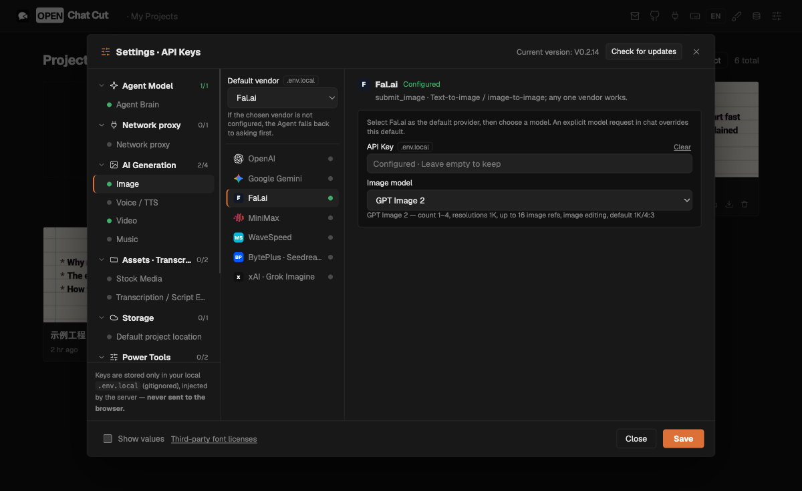
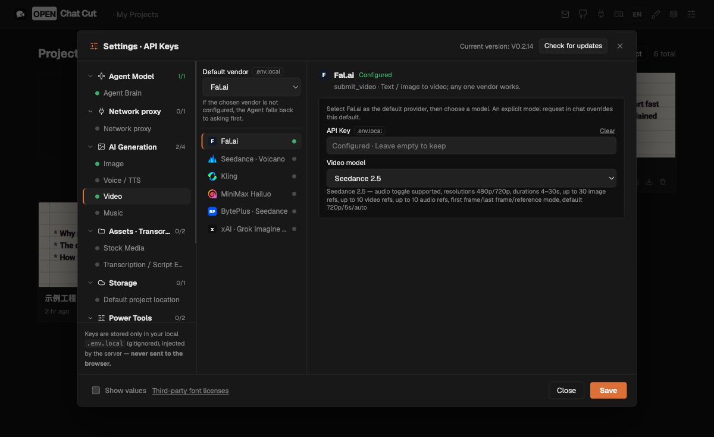

# Fal.ai generation

Fal.ai is an optional image/video provider. It uses the official `@fal-ai/client`
on the server and the existing media import and generation-job paths. Enabling
Fal does not replace native OpenAI, Gemini, Seedance, Kling, or other providers.

## Setup

1. Start OpenChatCut using its normal development command (Node 24).
2. Open **Settings → AI Generation → Image → Fal.ai** and save your API key.
   Alternatively put `FAL_KEY=your-key` in the Git-ignored `.env.local`.
3. Select **Fal.ai** in the capability's default-provider dropdown, then select
   an image model. Repeat under **Video → Fal.ai** for a video model.

The same key serves both capabilities. Model defaults are non-secret
`FAL_IMAGE_MODEL` and `FAL_VIDEO_MODEL`; provider defaults use the existing
`PREFERRED_IMAGE_VENDOR=fal` and `PREFERRED_VIDEO_VENDOR=fal` settings. A blank
model choice asks for a selection; it does not silently choose Seedance.
An explicit model request in chat overrides the saved default.

Never use `VITE_FAL_KEY` or place the key in client code. The browser receives
only key-configuration status and non-secret model preferences. Fal generation
is billed to your Fal account, independently of the conversational assistant.

## Settings

## Supported catalog

The catalog in [`shared/fal-models.ts`](shared/fal-models.ts) is the source of truth
for settings, assistant model choices, limits, and allowed endpoint paths.
Each entry links to its official schema. Only listed modes and common inputs
are supported; this is not arbitrary access to every endpoint in Fal's catalog.

| Type | Model ID | Model and supported outputs |
| --- | --- | --- |
| image | `nano-banana-2` | [Nano Banana 2 — count 1–4, resolutions 0.5K/1K/2K/4K, up to 14 image refs, image editing, default 1K/auto](https://fal.ai/models/fal-ai/nano-banana-2/api) |
| image | `nano-banana-pro` | [Nano Banana Pro — count 1–4, resolutions 1K/2K/4K, up to 14 image refs, image editing, default 1K/auto](https://fal.ai/docs/model-api-reference/image-generation-api/nano-banana-pro) |
| image | `gpt-image-2` | [GPT Image 2 — count 1–4, resolutions 1K, up to 16 image refs, image editing, default 1K/4:3](https://fal.ai/models/openai/gpt-image-2/api) |
| image | `flux-2` | [FLUX.2 — count 1–4, resolutions 1K, default 1K/4:3](https://fal.ai/models/fal-ai/flux-2/api) |
| image | `flux-2-pro` | [FLUX.2 Pro — count 1–1, resolutions 1K, up to 4 image refs, image editing, default 1K/4:3](https://fal.ai/models/fal-ai/flux-2-pro/api) |
| image | `seedream-5-pro` | [Seedream 5.0 Pro — count 1–1, resolutions 1K/2K, up to 10 image refs, image editing, default 2K/auto](https://fal.ai/models/bytedance/seedream/v5/pro/text-to-image/api) |
| image | `ideogram-4` | [Ideogram 4 — count 1–4, resolutions 1K, default 1K/1:1](https://fal.ai/models/ideogram/v4/api) |
| image | `qwen-image-3` | [Qwen Image 3 — count 1–4, resolutions 1K, default 1K/1:1](https://fal.ai/models/alibaba/qwen-image-3/text-to-image/api) |
| image | `recraft-v3` | [Recraft V3 — count 1–1, resolutions 1K, up to 1 image refs, image editing, default 1K/1:1](https://fal.ai/models/fal-ai/recraft/v3/text-to-image/api) |
| video | `seedance-2.5` | [Seedance 2.5 — audio toggle supported, resolutions 480p/720p, durations 4–30s, up to 30 image refs, up to 10 video refs, up to 10 audio refs, first frame/last frame/reference mode, default 720p/5s/auto](https://fal.ai/models/bytedance/seedance-2.5/text-to-video/api) |
| video | `seedance-2.0` | [Seedance 2.0 — audio toggle supported, resolutions 480p/720p/1080p/4k, durations 4–15s, up to 9 image refs, up to 3 video refs, up to 3 audio refs, first frame/last frame/reference mode, default 720p/5s/auto](https://fal.ai/models/bytedance/seedance-2.0/text-to-video/api) |
| video | `kling-v3-standard` | [Kling 3.0 Standard — audio toggle supported, resolutions 720p, durations 3–15s, first frame/last frame, default 720p/5s/16:9](https://fal.ai/models/fal-ai/kling-video/v3/standard/text-to-video/api) |
| video | `kling-v3-pro` | [Kling 3.0 Pro — audio toggle supported, resolutions 1080p, durations 3–15s, first frame/last frame, default 1080p/5s/16:9](https://fal.ai/models/fal-ai/kling-video/v3/pro/text-to-video/api) |
| video | `kling-o3-standard` | [Kling O3 Standard — audio toggle supported, resolutions 720p, durations 3–15s, up to 4 image refs, reference mode, default 720p/5s/16:9](https://fal.ai/models/fal-ai/kling-video/o3/standard/reference-to-video/api) |
| video | `kling-o3-pro` | [Kling O3 Pro — audio toggle supported, resolutions 1080p, durations 3–15s, up to 4 image refs, reference mode, default 1080p/5s/16:9](https://fal.ai/models/fal-ai/kling-video/o3/pro/reference-to-video/api) |
| video | `veo-3.1` | [Veo 3.1 — audio toggle supported, resolutions 720p/1080p/4k, durations 4/6/8s, first frame, default 720p/8s/16:9](https://fal.ai/models/fal-ai/veo3.1/api) |
| video | `veo-3.1-fast` | [Veo 3.1 Fast — audio toggle supported, resolutions 720p/1080p/4k, durations 4/6/8s, first frame, default 720p/8s/16:9](https://fal.ai/models/fal-ai/veo3.1/fast/image-to-video/api) |
| video | `wan-3.0` | [Wan 3.0 — audio toggle supported, resolutions 480p/720p/1080p, durations 5/10s, first frame/last frame, default 1080p/5s/adaptive](https://fal.ai/models/alibaba/wan-3.0/text-to-video/api) |
| video | `minimax-h3-max` | [MiniMax H3 Max — no audio toggle, resolutions 480p/768p/1080p, durations 5–15s, up to 9 image refs, up to 3 video refs, up to 3 audio refs, reference mode, default 768p/5s/16:9](https://fal.ai/models/minimax/h3-max/text-to-video/api) |
| video | `pixverse-v6` | [PixVerse V6 — audio toggle supported, resolutions 360p/540p/720p/1080p, durations 1–15s, first frame, default 720p/5s/16:9](https://fal.ai/models/fal-ai/pixverse/v6/text-to-video/api) |

## Generation and recovery

The assistant uses `submit_image` or `submit_video` with `model: "fal"` and a
`falModel` catalog ID. Omitting the ID uses a saved model choice; if neither is
present, the request fails locally before upload or generation. Unsupported
options and model-specific limits are validated before submission.

Project reference files upload from the server to Fal storage. No R2 account is
needed. The local upload ceiling is 30 MB per image, 50 MB per video, and 15 MB
per audio file; individual models can impose additional limits. Generated media
uses OpenChatCut's existing URL validation, size/MIME checks, and media library.

Video jobs save the concrete model selection, endpoint, and Fal request ID.
Polling or recovering a recorded job never submits a replacement generation.
Image generation retains the existing synchronous request flow: after a process
interruption or failed download, check Fal request history before generating
again. Automatic durable image recovery is not implemented.

## Verification

`npm run verify:fal` runs catalog validation, mocked queue recovery, official SDK
transport with mocked network, and provider-routing regression checks. It does
not require a real key and makes no paid generation calls. It also runs in the
normal `npm test` suite.

For an optional paid acceptance check, select Nano Banana 2 and request exactly
one 1K square image. Verify it appears in the media library and in your Fal
request history. Then select a video model and request one clip at its displayed
minimum supported duration. Confirm the clip imports and plays in the timeline.
Do not retry a stalled request until its status is known.

## Adding a model

1. Verify the official Fal input/output schemas, including the edit/frame modes.
2. Add a catalog entry with a stable ID, official endpoint paths, documentation
   link, supported limits, and conservative defaults.
3. Reuse a payload adapter only when the request fields really match. Otherwise
   add a focused mapping in `server/plugins/fal-catalog-input.ts`.
4. Add valid-mode fixtures and invalid-input checks to the catalog verification
   file. Test that unsupported controls fail before network activity.
5. Run `npm run verify:fal`, `npm test`, `npm run lint`, and `npm run build`.

No dynamic endpoint URL, generic JSON escape hatch, or automatic catalog download
is used. New models can be added without redesigning the editor or duplicating
its generation workflow. Training, speech, 3D, video editing/extension, masks,
and provider-specific advanced controls are outside this initial integration
unless explicitly listed for a catalog entry.
